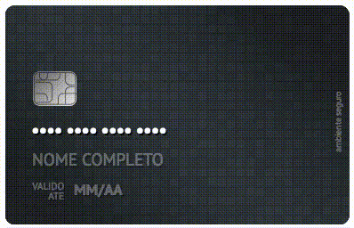

  

<h1 align="center">React Cards Component</h1>

  
  

  A modern credit card component for React

## About
This project provides a React component with the main credit cards of Brazilian banks.

## How to use
_Work in progress :)_
